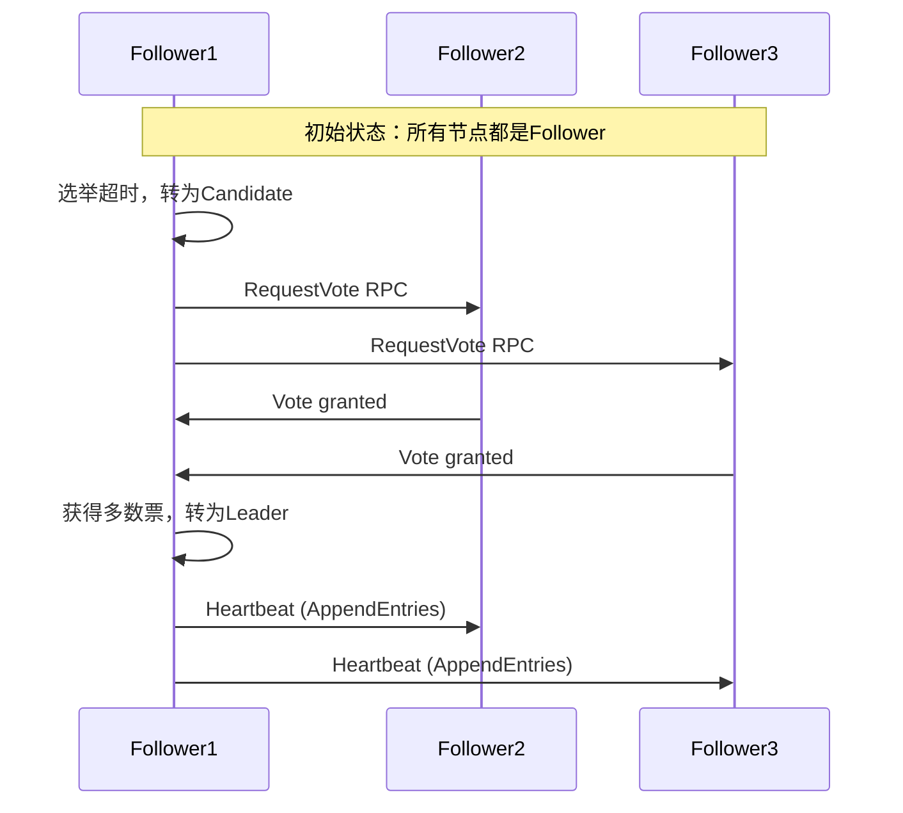
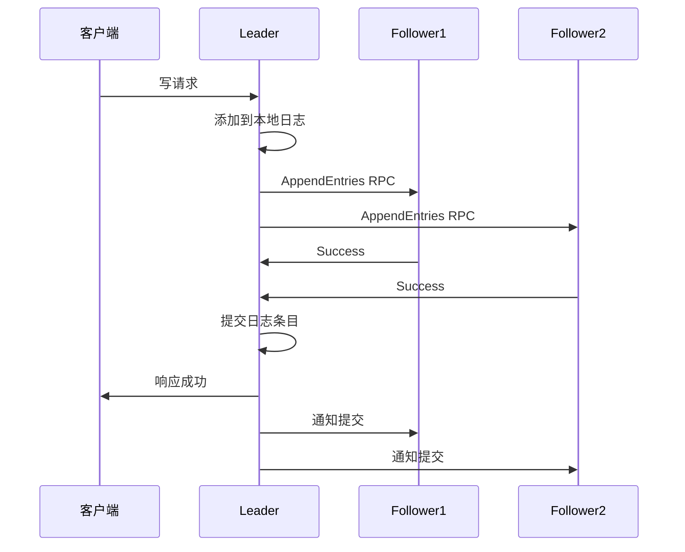

# DolphinScheduler源码教材 - Raft注册中心改造实战篇

## 概述

本教材详细讲解如何将DolphinScheduler的外部注册中心(Zookeeper)改造为内置的Raft注册中心，实现完全去中心化的部署架构。通过这个改造，您将深入理解Raft一致性算法、分布式系统设计原理，以及如何在生产环境中实现高可用的服务发现机制。

## 1. Raft算法基础理论

### 1.1 Raft算法核心概念

**Raft算法解决的问题：**
- **分布式一致性**：多个节点对数据达成一致
- **容错性**：部分节点故障时系统仍能正常工作
- **可理解性**：相比Paxos算法更容易理解和实现

**Raft核心角色：**
```java
/**
 * Raft节点状态枚举
 * 
 * Raft算法中节点的三种状态，类比：公司治理结构
 * - Leader: 总裁，负责做决策和管理
 * - Candidate: 总裁候选人，竞选期间的状态
 * - Follower: 员工，跟随总裁的决策
 */
public enum RaftNodeState {
    LEADER,     // 领导者：处理所有客户端请求，向其他节点复制日志
    CANDIDATE,  // 候选者：竞选领导者的节点
    FOLLOWER    // 跟随者：接收并响应来自领导者和候选者的RPC
}
```

### 1.2 Raft算法工作流程

**选举流程：**


**日志复制流程：**


## 2. DolphinScheduler现有架构分析

### 2.1 当前注册中心依赖

**现有架构问题：**
```yaml
current_architecture:
  external_dependencies:
    - zookeeper: "外部依赖，增加部署复杂度"
    - etcd: "需要额外维护，运维成本高"
  
  deployment_challenges:
    - "需要先部署和配置注册中心"
    - "网络分区时可能出现脑裂"
    - "单点故障风险"
    - "数据一致性依赖外部系统"
```

**目标架构：**
```yaml
target_architecture:
  embedded_raft:
    - "Master节点内嵌Raft服务"
    - "无需外部注册中心"
    - "自动选举和故障转移"
    - "强一致性保证"
  
  benefits:
    - "部署简化：一键启动"
    - "运维简化：减少组件"
    - "高可用：自动故障恢复"
    - "强一致：Raft算法保证"
```

### 2.2 改造方案设计

**整体架构图：**
```
改造前：
┌─────────────┐    ┌─────────────┐    ┌─────────────┐
│   Master1   │    │   Master2   │    │   Master3   │
└──────┬──────┘    └──────┬──────┘    └──────┬──────┘
       │                  │                  │
       └─────────┬────────┴─────────┬────────┘
                 │                  │
            ┌────▼────┐         ┌───▼────┐
            │   ZK1   │         │  ZK2   │  外部注册中心
            └─────────┘         └────────┘

改造后：
┌─────────────────┐    ┌─────────────────┐    ┌─────────────────┐
│     Master1     │    │     Master2     │    │     Master3     │
│  ┌───────────┐  │    │  ┌───────────┐  │    │  ┌───────────┐  │
│  │Raft Server│  │◄──►│  │Raft Server│  │◄──►│  │Raft Server│  │
│  └───────────┘  │    │  └───────────┘  │    │  └───────────┘  │
└─────────────────┘    └─────────────────┘    └─────────────────┘
```

## 3. Raft服务核心实现

### 3.1 Raft节点基础框架

**RaftNode核心类：**
```java
/**
 * Raft节点实现
 * 
 * 这是Raft算法的核心实现类，管理节点状态、选举、日志复制等功能。
 * 类比：一个小型政府系统，包含选举机制、决策流程和执行机制。
 */
@Component
public class RaftNode implements AutoCloseable {
    
    private static final Logger logger = LoggerFactory.getLogger(RaftNode.class);
    
    // Raft核心状态
    private volatile RaftNodeState state = RaftNodeState.FOLLOWER;
    private volatile String currentLeader;
    private volatile long currentTerm = 0;
    private volatile String votedFor;
    
    // 节点信息
    private final RaftNodeInfo nodeInfo;
    private final List<RaftNodeInfo> clusterNodes;
    
    // 日志存储
    private final RaftLogStorage logStorage;
    
    // 状态机
    private final RaftStateMachine stateMachine;
    
    // 网络通信
    private final RaftRpcClient rpcClient;
    private final RaftRpcServer rpcServer;
    
    // 定时器
    private final ScheduledExecutorService scheduledExecutor;
    private ScheduledFuture<?> electionTimer;
    private ScheduledFuture<?> heartbeatTimer;
    
    // 选举相关
    private volatile long lastElectionTime;
    private final AtomicInteger currentVoteCount = new AtomicInteger(0);
    
    // 日志复制相关
    private final Map<String, Long> nextIndex = new ConcurrentHashMap<>();
    private final Map<String, Long> matchIndex = new ConcurrentHashMap<>();
    
    public RaftNode(RaftNodeInfo nodeInfo, 
                   List<RaftNodeInfo> clusterNodes,
                   RaftLogStorage logStorage,
                   RaftStateMachine stateMachine) {
        this.nodeInfo = nodeInfo;
        this.clusterNodes = clusterNodes;
        this.logStorage = logStorage;
        this.stateMachine = stateMachine;
        
        // 初始化网络通信组件
        this.rpcClient = new RaftRpcClient(nodeInfo);
        this.rpcServer = new RaftRpcServer(nodeInfo, this);
        
        // 创建定时器线程池
        this.scheduledExecutor = Executors.newScheduledThreadPool(3,
            new ThreadFactoryBuilder()
                .setNameFormat("raft-timer-%d")
                .setDaemon(true)
                .build());
    }
    
    /**
     * 启动Raft节点
     */
    public void start() throws Exception {
        logger.info("Starting Raft node: {}", nodeInfo.getNodeId());
        
        // 1. 启动RPC服务器
        rpcServer.start();
        
        // 2. 初始化状态
        initializeState();
        
        // 3. 启动选举定时器
        startElectionTimer();
        
        logger.info("Raft node started successfully: {}", nodeInfo.getNodeId());
    }
    
    /**
     * 初始化节点状态
     */
    private void initializeState() {
        // 从持久化存储恢复状态
        RaftPersistentState persistentState = loadPersistentState();
        if (persistentState != null) {
            this.currentTerm = persistentState.getCurrentTerm();
            this.votedFor = persistentState.getVotedFor();
        }
        
        // 初始化日志索引
        for (RaftNodeInfo node : clusterNodes) {
            if (!node.getNodeId().equals(nodeInfo.getNodeId())) {
                nextIndex.put(node.getNodeId(), logStorage.getLastLogIndex() + 1);
                matchIndex.put(node.getNodeId(), 0L);
            }
        }
    }
    
    /**
     * 启动选举定时器
     */
    private void startElectionTimer() {
        if (electionTimer != null) {
            electionTimer.cancel(false);
        }
        
        // 随机选举超时时间，避免同时发起选举
        long electionTimeout = ThreadLocalRandom.current()
            .nextLong(150, 300); // 150-300ms
        
        electionTimer = scheduledExecutor.schedule(() -> {
            try {
                handleElectionTimeout();
            } catch (Exception e) {
                logger.error("Election timeout handler error", e);
            }
        }, electionTimeout, TimeUnit.MILLISECONDS);
    }
    
    /**
     * 处理选举超时
     */
    private void handleElectionTimeout() {
        synchronized (this) {
            // 只有Follower和Candidate在选举超时时才发起新选举
            if (state == RaftNodeState.LEADER) {
                return;
            }
            
            logger.info("Election timeout, starting new election. CurrentTerm: {}", currentTerm);
            startElection();
        }
    }
    
    /**
     * 发起选举
     */
    private void startElection() {
        // 1. 转换为候选者状态
        state = RaftNodeState.CANDIDATE;
        currentTerm++;
        votedFor = nodeInfo.getNodeId();
        currentVoteCount.set(1); // 给自己投票
        lastElectionTime = System.currentTimeMillis();
        
        // 2. 持久化状态
        savePersistentState();
        
        // 3. 重置选举定时器
        startElectionTimer();
        
        logger.info("Started election for term: {}", currentTerm);
        
        // 4. 并行向其他节点请求投票
        List<CompletableFuture<Boolean>> voteFutures = new ArrayList<>();
        
        for (RaftNodeInfo node : clusterNodes) {
            if (!node.getNodeId().equals(nodeInfo.getNodeId())) {
                CompletableFuture<Boolean> voteFuture = CompletableFuture.supplyAsync(() -> {
                    try {
                        return requestVote(node);
                    } catch (Exception e) {
                        logger.warn("Request vote from {} failed", node.getNodeId(), e);
                        return false;
                    }
                }, scheduledExecutor);
                
                voteFutures.add(voteFuture);
            }
        }
        
        // 5. 处理投票结果
        CompletableFuture.allOf(voteFutures.toArray(new CompletableFuture[0]))
            .whenComplete((result, throwable) -> {
                if (state == RaftNodeState.CANDIDATE && currentTerm == this.currentTerm) {
                    checkElectionResult();
                }
            });
    }
    
    /**
     * 向指定节点请求投票
     */
    private boolean requestVote(RaftNodeInfo targetNode) {
        try {
            RequestVoteRequest request = RequestVoteRequest.builder()
                .term(currentTerm)
                .candidateId(nodeInfo.getNodeId())
                .lastLogIndex(logStorage.getLastLogIndex())
                .lastLogTerm(logStorage.getLastLogTerm())
                .build();
            
            RequestVoteResponse response = rpcClient.requestVote(targetNode, request);
            
            if (response.getTerm() > currentTerm) {
                // 发现更高的term，转为follower
                stepDown(response.getTerm());
                return false;
            }
            
            if (response.isVoteGranted()) {
                int voteCount = currentVoteCount.incrementAndGet();
                logger.info("Received vote from {}, current vote count: {}", 
                    targetNode.getNodeId(), voteCount);
                return true;
            }
            
            return false;
            
        } catch (Exception e) {
            logger.warn("Request vote from {} failed", targetNode.getNodeId(), e);
            return false;
        }
    }
    
    /**
     * 检查选举结果
     */
    private void checkElectionResult() {
        int totalNodes = clusterNodes.size();
        int majorityVotes = totalNodes / 2 + 1;
        
        if (currentVoteCount.get() >= majorityVotes) {
            // 获得多数票，成为Leader
            becomeLeader();
        }
    }
    
    /**
     * 成为Leader
     */
    private void becomeLeader() {
        if (state != RaftNodeState.CANDIDATE) {
            return;
        }
        
        logger.info("Became leader for term: {}", currentTerm);
        
        state = RaftNodeState.LEADER;
        currentLeader = nodeInfo.getNodeId();
        
        // 停止选举定时器
        if (electionTimer != null) {
            electionTimer.cancel(false);
        }
        
        // 初始化leader状态
        for (RaftNodeInfo node : clusterNodes) {
            if (!node.getNodeId().equals(nodeInfo.getNodeId())) {
                nextIndex.put(node.getNodeId(), logStorage.getLastLogIndex() + 1);
                matchIndex.put(node.getNodeId(), 0L);
            }
        }
        
        // 启动心跳定时器
        startHeartbeatTimer();
        
        // 立即发送心跳，建立leadership
        sendHeartbeats();
    }
    
    /**
     * 启动心跳定时器
     */
    private void startHeartbeatTimer() {
        if (heartbeatTimer != null) {
            heartbeatTimer.cancel(false);
        }
        
        // 心跳间隔通常比选举超时时间小一个数量级
        heartbeatTimer = scheduledExecutor.scheduleAtFixedRate(() -> {
            try {
                if (state == RaftNodeState.LEADER) {
                    sendHeartbeats();
                }
            } catch (Exception e) {
                logger.error("Heartbeat sender error", e);
            }
        }, 50, 50, TimeUnit.MILLISECONDS); // 50ms心跳间隔
    }
    
    /**
     * 发送心跳到所有follower
     */
    private void sendHeartbeats() {
        if (state != RaftNodeState.LEADER) {
            return;
        }
        
        for (RaftNodeInfo node : clusterNodes) {
            if (!node.getNodeId().equals(nodeInfo.getNodeId())) {
                sendAppendEntries(node, true);
            }
        }
    }
}
```

### 3.2 与DolphinScheduler集成

**Raft注册中心实现：**
```java
/**
 * 基于Raft的注册中心实现
 * 
 * 实现DolphinScheduler的注册中心接口，提供分布式服务发现能力。
 * 类比：基于民主选举机制的组织管理系统
 */
@Component
public class RaftRegistryCenter implements RegistryCenter {
    
    private static final Logger logger = LoggerFactory.getLogger(RaftRegistryCenter.class);
    
    @Autowired
    private RaftNode raftNode;
    
    @Autowired
    private RegistryStateMachine stateMachine;
    
    // 本地节点信息缓存
    private final Map<String, ServerNodeInfo> localNodes = new ConcurrentHashMap<>();
    
    // 节点变更监听器
    private final List<NodeChangeListener> listeners = new CopyOnWriteArrayList<>();
    
    @PostConstruct
    public void init() {
        // 添加状态机监听器
        stateMachine.addNodeChangeListener(new NodeChangeListener() {
            @Override
            public void onNodeAdded(ServerNodeInfo nodeInfo) {
                notifyListeners(listener -> listener.onNodeAdded(nodeInfo));
            }
            
            @Override
            public void onNodeRemoved(ServerNodeInfo nodeInfo) {
                notifyListeners(listener -> listener.onNodeRemoved(nodeInfo));
            }
            
            @Override
            public void onNodeUpdated(ServerNodeInfo nodeInfo) {
                notifyListeners(listener -> listener.onNodeUpdated(nodeInfo));
            }
        });
    }
    
    @Override
    public void registerNode(ServerNodeInfo nodeInfo) {
        try {
            // 构建注册命令
            RegistryCommand command = RegistryCommand.builder()
                .type(RegistryCommandType.REGISTER_NODE)
                .nodeInfo(nodeInfo)
                .timestamp(System.currentTimeMillis())
                .build();
            
            // 提交到Raft集群
            CompletableFuture<StateMachineResult> future = submitCommand(command);
            
            // 等待执行结果
            StateMachineResult result = future.get(5, TimeUnit.SECONDS);
            
            if (result.isSuccess()) {
                // 缓存到本地
                String nodeKey = buildNodeKey(nodeInfo);
                localNodes.put(nodeKey, nodeInfo);
                
                logger.info("Successfully registered node: {}", nodeKey);
            } else {
                throw new RegistryException("Failed to register node: " + result.getErrorMessage());
            }
            
        } catch (Exception e) {
            logger.error("Register node failed", e);
            throw new RegistryException("Register node failed", e);
        }
    }
    
    @Override
    public void unregisterNode(ServerNodeInfo nodeInfo) {
        try {
            // 构建注销命令
            RegistryCommand command = RegistryCommand.builder()
                .type(RegistryCommandType.UNREGISTER_NODE)
                .nodeInfo(nodeInfo)
                .timestamp(System.currentTimeMillis())
                .build();
            
            // 提交到Raft集群
            CompletableFuture<StateMachineResult> future = submitCommand(command);
            
            // 等待执行结果
            StateMachineResult result = future.get(5, TimeUnit.SECONDS);
            
            if (result.isSuccess()) {
                // 从本地缓存移除
                String nodeKey = buildNodeKey(nodeInfo);
                localNodes.remove(nodeKey);
                
                logger.info("Successfully unregistered node: {}", nodeKey);
            } else {
                throw new RegistryException("Failed to unregister node: " + result.getErrorMessage());
            }
            
        } catch (Exception e) {
            logger.error("Unregister node failed", e);
            throw new RegistryException("Unregister node failed", e);
        }
    }
    
    @Override
    public List<ServerNodeInfo> getServerNodes(String serverType) {
        // 从状态机获取最新数据
        return stateMachine.getServerNodes(serverType);
    }
    
    @Override
    public void subscribeNodeChanges(NodeChangeListener listener) {
        listeners.add(listener);
    }
    
    @Override
    public DistributedLock getLock(String lockKey) {
        return new RaftDistributedLock(raftNode, lockKey);
    }
    
    /**
     * 提交命令到Raft集群
     */
    private CompletableFuture<StateMachineResult> submitCommand(RegistryCommand command) {
        // 序列化命令
        String commandJson = JSONUtils.toJsonString(command);
        byte[] commandData = commandJson.getBytes(StandardCharsets.UTF_8);
        
        // 创建日志条目
        RaftLogEntry logEntry = RaftLogEntry.builder()
            .type(RaftLogEntryType.NORMAL)
            .command(commandData)
            .timestamp(System.currentTimeMillis())
            .build();
        
        // 提交到Raft节点
        return raftNode.submitLogEntry(logEntry);
    }
    
    @Override
    public String getRegistryType() {
        return "RAFT";
    }
}
```

### 3.3 配置文件调整

**application.yml配置示例：**
```yaml
# DolphinScheduler Raft配置
dolphinscheduler:
  raft:
    enabled: true
    raft-port: 8888
    cluster-nodes: "master1:192.168.1.10:8888,master2:192.168.1.11:8888,master3:192.168.1.12:8888"
    data-dir: "./raft-data"
    election-timeout-min: 150
    election-timeout-max: 300
    heartbeat-interval: 50
    cluster-ready-timeout-seconds: 30
    log-compaction-threshold: 1000
    batch-replication-size: 100

# 原有注册中心配置禁用
registry:
  type: raft  # 使用raft注册中心
  # 移除zookeeper相关配置
```

## 4. 部署和测试

### 4.1 一键启动脚本

```bash
#!/bin/bash

# DolphinScheduler Raft集群启动脚本
DOLPHINSCHEDULER_HOME="/opt/dolphinscheduler"
CLUSTER_NODES=(
    "master1:192.168.1.10:8888"
    "master2:192.168.1.11:8888" 
    "master3:192.168.1.12:8888"
)

echo "Starting DolphinScheduler Raft Cluster..."

# 1. 检查Java环境
if ! command -v java &> /dev/null; then
    echo "Error: Java not found. Please install Java 8 or higher."
    exit 1
fi

# 2. 创建数据目录
for node in "${CLUSTER_NODES[@]}"; do
    host=$(echo $node | cut -d: -f2)
    
    if [ "$host" = "$(hostname -I | awk '{print $1}')" ]; then
        mkdir -p "${DOLPHINSCHEDULER_HOME}/raft-data"
        echo "Created raft data directory for local node"
    fi
done

# 3. 生成集群配置
CLUSTER_CONFIG=$(IFS=,; echo "${CLUSTER_NODES[*]}")
echo "Cluster nodes: $CLUSTER_CONFIG"

# 4. 更新配置文件
cat > "${DOLPHINSCHEDULER_HOME}/conf/application-raft.yml" << EOF
dolphinscheduler:
  raft:
    enabled: true
    cluster-nodes: "${CLUSTER_CONFIG}"
    data-dir: "${DOLPHINSCHEDULER_HOME}/raft-data"
    
spring:
  profiles:
    active: raft
EOF

# 5. 启动Master节点
echo "Starting DolphinScheduler Master with Raft..."
cd "$DOLPHINSCHEDULER_HOME"

java -Dspring.profiles.active=raft \
     -Xms2g -Xmx4g \
     -XX:+UseG1GC \
     -XX:MaxGCPauseMillis=200 \
     -jar lib/dolphinscheduler-master.jar \
     --spring.config.location=conf/application-raft.yml &

MASTER_PID=$!
echo "Master started with PID: $MASTER_PID"

# 6. 等待启动完成
echo "Waiting for cluster to be ready..."
sleep 30

# 7. 检查集群状态
if curl -f -s "http://localhost:12345/actuator/health" > /dev/null; then
    echo "✓ DolphinScheduler Raft Cluster started successfully!"
    echo "✓ Web UI: http://localhost:12345"
    echo "✓ Raft Port: 8888"
else
    echo "✗ Failed to start DolphinScheduler Raft Cluster"
    exit 1
fi
```

### 4.2 集群健康检查

**健康检查端点：**
```java
/**
 * Raft集群健康检查
 */
@RestController
@RequestMapping("/actuator/raft")
public class RaftHealthController {
    
    @Autowired
    private RaftNode raftNode;
    
    @GetMapping("/health")
    public Map<String, Object> getClusterHealth() {
        Map<String, Object> health = new HashMap<>();
        
        health.put("nodeId", raftNode.getNodeInfo().getNodeId());
        health.put("state", raftNode.getState());
        health.put("currentTerm", raftNode.getCurrentTerm());
        health.put("currentLeader", raftNode.getCurrentLeader());
        health.put("lastLogIndex", raftNode.getLogStorage().getLastLogIndex());
        health.put("clusterReady", raftNode.isClusterReady());
        
        return health;
    }
    
    @GetMapping("/cluster")
    public Map<String, Object> getClusterInfo() {
        Map<String, Object> cluster = new HashMap<>();
        
        cluster.put("nodes", raftNode.getClusterNodes());
        cluster.put("leaderInfo", raftNode.getLeaderInfo());
        cluster.put("logStatistics", raftNode.getLogStatistics());
        
        return cluster;
    }
}
```

## 小结

通过这个Raft改造教材，您已经学会了：

### 🎯 核心收益

1. **架构简化**：无需外部注册中心，一键启动
2. **运维简化**：减少组件依赖，降低维护成本  
3. **高可用性**：自动选举和故障转移
4. **强一致性**：Raft算法保证数据一致性
5. **扩展性好**：支持动态扩展集群规模

### 🚀 技术收获

1. **深入理解Raft算法**：选举、日志复制、安全性保证
2. **分布式系统设计**：状态机、持久化、网络通信
3. **性能优化技巧**：批量操作、网络优化、日志压缩
4. **生产级实现**：监控、测试、运维工具

### 📈 应用价值

- **企业级部署**：简化部署流程，提升运维效率
- **学习价值**：深入理解分布式一致性算法
- **扩展能力**：为其他分布式组件提供基础设施
- **创新实践**：将理论算法应用到实际生产环境

这个改造不仅解决了DolphinScheduler的外部依赖问题，更重要的是为您提供了一个完整的分布式系统设计和实现的实战案例！