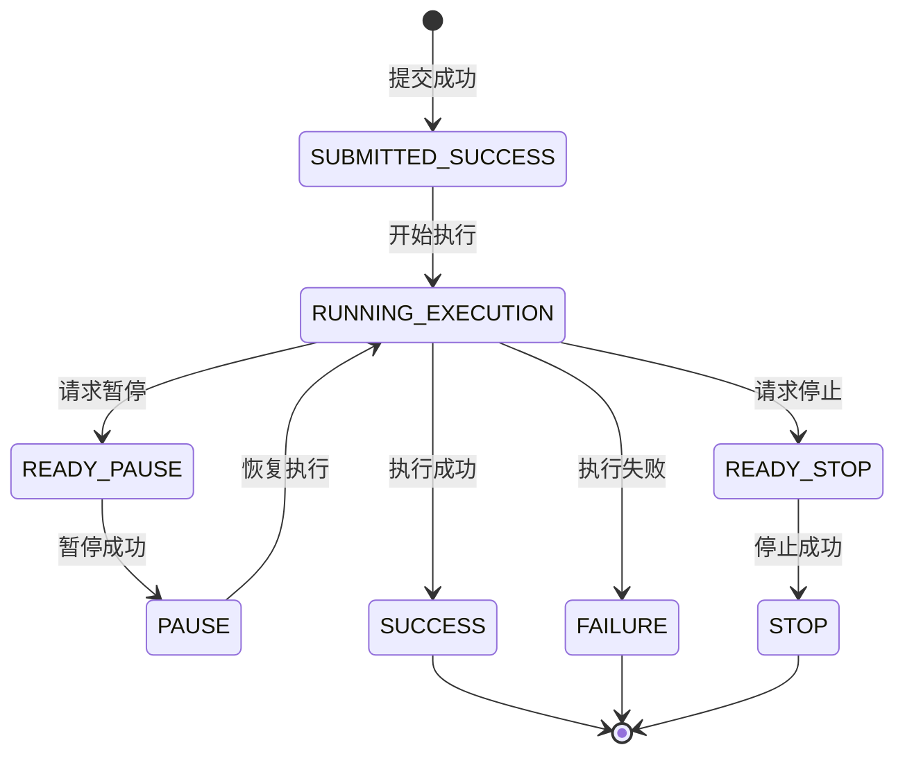

# DolphinScheduler源码教材 - 核心设计模式篇

## 概述

DolphinScheduler在架构设计中巧妙运用了多种设计模式，这些模式不仅提升了代码的可维护性和扩展性，也体现了分布式系统设计的最佳实践。本教材将深入解析系统中使用的核心设计模式。

## 1. 命令模式 (Command Pattern)

### 1.1 模式应用场景

DolphinScheduler使用命令模式来处理各种工作流操作，将请求封装成命令对象，实现请求的排队、记录和撤销等功能。

### 1.2 核心实现

**Command接口定义：**
```java
/**
 * 命令抽象接口
 * 
 * 将不同类型的工作流操作抽象为统一的命令接口，
 * 类比：就像遥控器的按钮，每个按钮都是一个命令
 */
public class Command {
    private Long id;                        // 命令ID
    private CommandType commandType;        // 命令类型
    private Long workflowDefinitionCode;    // 工作流定义编码
    private String commandParam;            // 命令参数
    private TaskDependType taskDependType;  // 任务依赖类型
    private FailureStrategy failureStrategy; // 失败策略
    private Priority workflowInstancePriority; // 优先级
    
    // 构建器模式创建命令
    public static CommandBuilder builder() {
        return new CommandBuilder();
    }
}
```

**命令类型枚举：**
```java
public enum CommandType {
    START_PROCESS(0, "启动工作流"),
    SCHEDULER(8, "调度触发"),
    REPEAT_RUNNING(1, "重复运行"),
    PAUSE(2, "暂停"),
    STOP(3, "停止"),
    RECOVER_TOLERANCE_FAULT_PROCESS(4, "容错恢复"),
    RECOVER_SERIAL_WAIT(5, "串行等待恢复"),
    RECOVER_WAITING_THREAD(7, "等待线程恢复");
    
    private final int code;
    private final String desc;
}
```

**命令处理器接口：**
```java
/**
 * 命令处理器接口
 * 
 * 定义统一的命令处理接口，每种命令类型对应一个具体处理器。
 * 类比：不同类型的工单需要不同的处理专员
 */
public interface ICommandHandler {
    
    /**
     * 处理命令
     * @param command 要处理的命令
     */
    void handle(Command command);
    
    /**
     * 获取支持的命令类型
     * @return 命令类型
     */
    CommandType getCommandType();
}
```

**具体命令处理器实现：**
```java
/**
 * 运行工作流命令处理器
 * 
 * 专门处理START_PROCESS类型的命令，负责启动工作流实例。
 * 类比：项目启动专员，负责启动新项目
 */
@Component
public class RunWorkflowCommandHandler implements ICommandHandler {
    
    @Override
    public void handle(Command command) {
        try {
            // 1. 解析命令参数
            RunWorkflowCommandParam commandParam = 
                parseCommandParam(command.getCommandParam());
            
            // 2. 加载工作流定义
            WorkflowDefinition workflowDefinition = 
                loadWorkflowDefinition(command.getWorkflowDefinitionCode());
            
            // 3. 创建工作流实例
            WorkflowInstance workflowInstance = 
                createWorkflowInstance(command, workflowDefinition);
            
            // 4. 构建执行图
            WorkflowExecuteGraph executeGraph = 
                buildWorkflowExecuteGraph(workflowInstance);
            
            // 5. 创建执行运行时
            WorkflowExecuteRunnable executeRunnable = 
                new WorkflowExecuteRunnable(workflowInstance, executeGraph);
            
            // 6. 提交到执行引擎
            masterEngine.submitWorkflowExecuteRunnable(executeRunnable);
            
        } catch (Exception e) {
            logger.error("Handle run workflow command failed", e);
            throw new CommandHandleException("Command execution failed", e);
        }
    }
    
    @Override
    public CommandType getCommandType() {
        return CommandType.START_PROCESS;
    }
}
```

**命令管理器：**
```java
/**
 * 命令处理管理器
 * 
 * 负责注册和分发命令到对应的处理器。
 * 类比：总调度室，根据工单类型分配给不同的处理部门
 */
@Component
public class CommandHandlerManager {
    
    // 命令类型与处理器的映射关系
    private final Map<CommandType, ICommandHandler> handlerMap = new HashMap<>();
    
    @PostConstruct
    public void init() {
        // 自动注册所有命令处理器
        applicationContext.getBeansOfType(ICommandHandler.class)
            .values()
            .forEach(handler -> handlerMap.put(handler.getCommandType(), handler));
    }
    
    /**
     * 分发命令到对应处理器
     */
    public void dispatch(Command command) {
        ICommandHandler handler = handlerMap.get(command.getCommandType());
        
        if (handler == null) {
            throw new UnsupportedCommandException(
                "No handler found for command type: " + command.getCommandType());
        }
        
        try {
            handler.handle(command);
        } catch (Exception e) {
            logger.error("Command dispatch failed: {}", command, e);
            throw new CommandDispatchException("Command dispatch failed", e);
        }
    }
}
```

### 1.3 模式优势

1. **解耦请求与处理**：请求发起者不需要知道具体处理逻辑
2. **易于扩展**：新增命令类型只需要添加新的处理器
3. **支持撤销**：可以记录命令历史，支持撤销操作
4. **支持排队**：命令可以放入队列延迟处理

## 2. 状态机模式 (State Machine Pattern)

### 2.1 模式应用场景

工作流和任务的状态管理是调度系统的核心，DolphinScheduler使用状态机模式来管理复杂的状态转换。

### 2.2 核心实现

**状态接口定义：**
```java
/**
 * 工作流实例状态处理接口
 * 
 * 每个状态都有对应的处理器，负责该状态下的具体逻辑。
 * 类比：每个工作阶段都有专门的负责人
 */
public interface IWorkflowInstanceStateAction {
    
    /**
     * 处理状态事件
     * @param stateEvent 状态事件
     */
    void action(StateEvent stateEvent);
    
    /**
     * 获取处理的状态类型
     * @return 工作流执行状态
     */
    WorkflowExecutionStatus getEventType();
}
```

**具体状态处理器：**
```java
/**
 * 工作流运行状态处理器
 * 
 * 处理工作流在运行状态下的各种操作和状态转换。
 * 类比：项目执行阶段的项目经理，负责协调项目执行过程中的各种事务
 */
@Component
public class WorkflowRunningStateAction implements IWorkflowInstanceStateAction {
    
    @Override
    public void action(StateEvent stateEvent) {
        WorkflowInstance workflowInstance = stateEvent.getWorkflowInstance();
        
        try {
            // 1. 检查是否需要暂停
            if (needToPause(workflowInstance)) {
                handlePauseRequest(workflowInstance);
                return;
            }
            
            // 2. 检查是否需要停止
            if (needToStop(workflowInstance)) {
                handleStopRequest(workflowInstance);
                return;
            }
            
            // 3. 处理任务状态变化
            processTaskStateChanges(workflowInstance);
            
            // 4. 检查工作流是否完成
            if (checkWorkflowCompletion(workflowInstance)) {
                WorkflowExecutionStatus finalStatus = 
                    determineFinalStatus(workflowInstance);
                transitionToFinalState(workflowInstance, finalStatus);
            }
            
        } catch (Exception e) {
            logger.error("Handle workflow running state error", e);
            transitionToFailureState(workflowInstance, e);
        }
    }
    
    @Override
    public WorkflowExecutionStatus getEventType() {
        return WorkflowExecutionStatus.RUNNING_EXECUTION;
    }
    
    /**
     * 检查工作流是否完成
     */
    private boolean checkWorkflowCompletion(WorkflowInstance workflowInstance) {
        List<TaskInstance> taskInstances = 
            taskInstanceDao.findByWorkflowInstanceId(workflowInstance.getId());
        
        // 所有任务都已完成（成功或失败）
        return taskInstances.stream().allMatch(task -> task.getState().isFinished());
    }
    
    /**
     * 确定工作流最终状态
     */
    private WorkflowExecutionStatus determineFinalStatus(WorkflowInstance workflowInstance) {
        List<TaskInstance> taskInstances = 
            taskInstanceDao.findByWorkflowInstanceId(workflowInstance.getId());
        
        // 检查是否有失败的任务
        boolean hasFailedTask = taskInstances.stream()
            .anyMatch(task -> task.getState() == TaskExecutionStatus.FAILURE);
        
        if (hasFailedTask) {
            // 根据失败策略决定最终状态
            FailureStrategy failureStrategy = workflowInstance.getFailureStrategy();
            return failureStrategy == FailureStrategy.END ? 
                WorkflowExecutionStatus.FAILURE : WorkflowExecutionStatus.SUCCESS;
        }
        
        return WorkflowExecutionStatus.SUCCESS;
    }
}
```

**状态事件：**
```java
/**
 * 状态事件
 * 
 * 封装状态变化的相关信息，触发状态机的状态转换。
 * 类比：工作流程中的各种事件通知
 */
public class StateEvent {
    private Long workflowInstanceId;        // 工作流实例ID
    private Long taskInstanceId;            // 任务实例ID（可选）
    private WorkflowExecutionStatus type;   // 事件类型
    private String context;                 // 事件上下文
    private Date executeTime;               // 执行时间
    
    // 工作流实例（延迟加载）
    private WorkflowInstance workflowInstance;
}
```

**状态机管理器：**
```java
/**
 * 状态机管理器
 * 
 * 负责状态事件的分发和状态处理器的管理。
 * 类比：流程控制中心，根据不同的流程状态分派给不同的处理部门
 */
@Component
public class StateEventHandlerManager {
    
    // 状态类型与处理器的映射
    private final Map<WorkflowExecutionStatus, IWorkflowInstanceStateAction> stateActionMap;
    
    @PostConstruct
    public void init() {
        // 自动注册所有状态处理器
        stateActionMap = applicationContext.getBeansOfType(IWorkflowInstanceStateAction.class)
            .values()
            .stream()
            .collect(Collectors.toMap(
                IWorkflowInstanceStateAction::getEventType,
                Function.identity()
            ));
    }
    
    /**
     * 处理状态事件
     */
    public void handleStateEvent(StateEvent stateEvent) {
        IWorkflowInstanceStateAction stateAction = 
            stateActionMap.get(stateEvent.getType());
        
        if (stateAction == null) {
            logger.warn("No state action found for event type: {}", stateEvent.getType());
            return;
        }
        
        try {
            stateAction.action(stateEvent);
        } catch (Exception e) {
            logger.error("Handle state event failed: {}", stateEvent, e);
            // 状态处理失败时的兜底处理
            handleStateEventException(stateEvent, e);
        }
    }
}
```

### 2.3 状态转换图



## 3. 观察者模式 (Observer Pattern)

### 3.1 模式应用场景

DolphinScheduler使用事件总线实现观察者模式，用于处理系统中的各种生命周期事件。

### 3.2 核心实现

**事件总线接口：**
```java
/**
 * 抽象事件总线
 * 
 * 定义事件发布和订阅的基本接口。
 * 类比：广播电台，可以发布消息给所有监听者
 */
public abstract class AbstractEventBus<T extends AbstractLifecycleEvent> {
    
    // 事件监听器列表
    protected final List<ILifecycleEventHandler<T>> eventHandlers = new CopyOnWriteArrayList<>();
    
    /**
     * 发布事件
     */
    public void publish(T event) {
        // 异步处理事件，避免阻塞主线程
        CompletableFuture.runAsync(() -> {
            for (ILifecycleEventHandler<T> handler : eventHandlers) {
                try {
                    if (handler.filter(event)) {
                        handler.handle(event);
                    }
                } catch (Exception e) {
                    logger.error("Handle event failed: {}", event, e);
                }
            }
        }, eventProcessorExecutor);
    }
    
    /**
     * 注册事件监听器
     */
    public void subscribe(ILifecycleEventHandler<T> eventHandler) {
        eventHandlers.add(eventHandler);
    }
    
    /**
     * 取消注册事件监听器  
     */
    public void unsubscribe(ILifecycleEventHandler<T> eventHandler) {
        eventHandlers.remove(eventHandler);
    }
}
```

**生命周期事件处理器：**
```java
/**
 * 抽象生命周期事件处理器
 * 
 * 定义事件处理的通用框架，具体处理器继承实现。
 * 类比：事件处理专员的工作模板
 */
public abstract class AbstractLifecycleEventHandler<T extends AbstractLifecycleEvent> 
    implements ILifecycleEventHandler<T> {
    
    @Override
    public final void handle(T event) {
        try {
            // 1. 事件前置检查
            if (!filter(event)) {
                return;
            }
            
            // 2. 执行具体处理逻辑
            handleEvent(event);
            
            // 3. 事件后置处理
            afterHandle(event);
            
        } catch (Exception e) {
            // 4. 异常处理
            handleException(event, e);
        }
    }
    
    /**
     * 事件过滤器，子类可重写
     */
    protected boolean filter(T event) {
        return true;
    }
    
    /**
     * 具体事件处理逻辑，子类必须实现
     */
    protected abstract void handleEvent(T event);
    
    /**
     * 事件处理后的回调，子类可重写
     */
    protected void afterHandle(T event) {
        // 默认空实现
    }
    
    /**
     * 异常处理，子类可重写
     */
    protected void handleException(T event, Exception e) {
        logger.error("Handle lifecycle event failed: {}", event, e);
    }
}
```

**具体事件处理器：**
```java
/**
 * 任务成功生命周期事件处理器
 * 
 * 处理任务执行成功的事件，更新相关状态和触发后续处理。
 * 类比：任务完成确认专员
 */
@Component
public class TaskSuccessLifecycleEventHandler extends AbstractLifecycleEventHandler<TaskSuccessLifecycleEvent> {
    
    @Override
    protected void handleEvent(TaskSuccessLifecycleEvent event) {
        TaskInstance taskInstance = event.getTaskInstance();
        
        logger.info("Handle task success event: taskId={}", taskInstance.getId());
        
        // 1. 更新任务状态
        updateTaskInstanceStatus(taskInstance, TaskExecutionStatus.SUCCESS);
        
        // 2. 记录执行日志
        recordTaskExecutionLog(taskInstance, "Task executed successfully");
        
        // 3. 检查并触发下游任务
        triggerDownstreamTasks(taskInstance);
        
        // 4. 检查工作流是否可以完成
        checkWorkflowCompletion(taskInstance.getWorkflowInstance());
        
        // 5. 发送成功通知（如果配置了）
        sendSuccessNotification(taskInstance);
    }
    
    /**
     * 触发下游任务
     */
    private void triggerDownstreamTasks(TaskInstance completedTask) {
        // 获取下游任务列表
        List<TaskInstance> downstreamTasks = 
            getDownstreamTasks(completedTask);
        
        for (TaskInstance downstreamTask : downstreamTasks) {
            // 检查依赖是否满足
            if (isDependencySatisfied(downstreamTask)) {
                // 提交任务到分发器
                taskDispatcher.dispatchTask(downstreamTask);
            }
        }
    }
    
    @Override
    protected boolean filter(TaskSuccessLifecycleEvent event) {
        // 只处理非重复的成功事件
        return !event.isRepeated();
    }
}
```

## 4. 策略模式 (Strategy Pattern)

### 4.1 模式应用场景

DolphinScheduler使用策略模式来处理不同类型的任务执行、负载均衡算法选择等场景。

### 4.2 核心实现

**负载均衡策略接口：**
```java
/**
 * 负载均衡策略接口
 * 
 * 定义节点选择的统一接口，不同策略实现不同的选择算法。
 * 类比：不同的任务分配策略
 */
public interface LoadBalanceStrategy {
    
    /**
     * 从可用节点中选择一个节点
     * 
     * @param availableNodes 可用节点列表
     * @param context 选择上下文（任务信息、历史负载等）
     * @return 选择的节点，如果没有可用节点返回null
     */
    ServerNodeInfo select(List<ServerNodeInfo> availableNodes, SelectionContext context);
    
    /**
     * 获取策略名称
     */
    String getStrategyName();
}
```

**轮询策略实现：**
```java
/**
 * 轮询负载均衡策略
 * 
 * 按照轮询方式依次选择节点，保证各节点请求分布均匀。
 * 类比：按顺序轮流分配任务
 */
@Component
public class RoundRobinLoadBalanceStrategy implements LoadBalanceStrategy {
    
    // 使用原子计数器保证线程安全
    private final AtomicLong roundRobinIndex = new AtomicLong(0);
    
    @Override
    public ServerNodeInfo select(List<ServerNodeInfo> availableNodes, SelectionContext context) {
        if (CollectionUtils.isEmpty(availableNodes)) {
            return null;
        }
        
        // 计算选择索引
        long currentIndex = roundRobinIndex.getAndIncrement();
        int index = (int) (currentIndex % availableNodes.size());
        
        return availableNodes.get(index);
    }
    
    @Override
    public String getStrategyName() {
        return "ROUND_ROBIN";
    }
}
```

**权重策略实现：**
```java
/**
 * 权重负载均衡策略
 * 
 * 根据节点负载情况动态计算权重，负载低的节点获得更多任务。
 * 类比：能力强、空闲的人员分配更多工作
 */
@Component  
public class WeightedLoadBalanceStrategy implements LoadBalanceStrategy {
    
    @Override
    public ServerNodeInfo select(List<ServerNodeInfo> availableNodes, SelectionContext context) {
        if (CollectionUtils.isEmpty(availableNodes)) {
            return null;
        }
        
        // 1. 计算每个节点的权重
        List<WeightedNode> weightedNodes = availableNodes.stream()
            .map(node -> new WeightedNode(node, calculateWeight(node)))
            .collect(Collectors.toList());
        
        // 2. 按权重随机选择
        return weightedRandomSelect(weightedNodes);
    }
    
    /**
     * 计算节点权重
     * 权重越高表示节点负载越低，越容易被选中
     */
    private int calculateWeight(ServerNodeInfo node) {
        // 基础权重
        int baseWeight = 100;
        
        // 根据CPU使用率调整权重
        double cpuUsage = node.getCpuUsage();
        baseWeight -= (int) (cpuUsage * 50);
        
        // 根据内存使用率调整权重
        double memoryUsage = node.getMemoryUsage();  
        baseWeight -= (int) (memoryUsage * 30);
        
        // 根据运行任务数调整权重
        int runningTaskCount = node.getRunningTaskCount();
        baseWeight -= runningTaskCount * 2;
        
        // 保证最小权重为1
        return Math.max(baseWeight, 1);
    }
    
    /**
     * 加权随机选择
     */
    private ServerNodeInfo weightedRandomSelect(List<WeightedNode> weightedNodes) {
        int totalWeight = weightedNodes.stream()
            .mapToInt(WeightedNode::getWeight)
            .sum();
        
        int randomWeight = ThreadLocalRandom.current().nextInt(totalWeight);
        int currentWeight = 0;
        
        for (WeightedNode weightedNode : weightedNodes) {
            currentWeight += weightedNode.getWeight();
            if (currentWeight > randomWeight) {
                return weightedNode.getNode();
            }
        }
        
        // 兜底返回第一个节点
        return weightedNodes.get(0).getNode();
    }
    
    @Override
    public String getStrategyName() {
        return "WEIGHTED";
    }
}
```

**策略上下文：**
```java
/**
 * 负载均衡策略上下文
 * 
 * 策略管理器，负责选择和使用合适的负载均衡策略。
 * 类比：策略顾问，根据情况选择最合适的策略
 */
@Component
public class LoadBalanceStrategyContext {
    
    // 策略映射表
    private final Map<String, LoadBalanceStrategy> strategyMap;
    
    @Autowired
    public LoadBalanceStrategyContext(List<LoadBalanceStrategy> strategies) {
        this.strategyMap = strategies.stream()
            .collect(Collectors.toMap(
                LoadBalanceStrategy::getStrategyName,
                Function.identity()
            ));
    }
    
    /**
     * 选择节点
     * 
     * @param strategyName 策略名称
     * @param availableNodes 可用节点
     * @param context 选择上下文
     * @return 选择的节点
     */
    public ServerNodeInfo selectNode(String strategyName, 
                                   List<ServerNodeInfo> availableNodes,
                                   SelectionContext context) {
        LoadBalanceStrategy strategy = strategyMap.get(strategyName);
        
        if (strategy == null) {
            // 策略不存在，使用默认的轮询策略
            strategy = strategyMap.get("ROUND_ROBIN");
        }
        
        return strategy.select(availableNodes, context);
    }
    
    /**
     * 获取所有可用策略
     */
    public Set<String> getAvailableStrategies() {
        return strategyMap.keySet();
    }
}
```

## 5. 工厂模式 (Factory Pattern)

### 5.1 模式应用场景

DolphinScheduler使用工厂模式来创建不同类型的任务执行器和其他组件。

### 5.2 核心实现

**任务执行器工厂：**
```java
/**
 * 任务执行器工厂
 * 
 * 根据任务类型创建对应的执行器实例。
 * 类比：专业工具制造厂，根据需要生产不同类型的工具
 */
@Component
public class TaskExecutorFactory {
    
    // 任务执行器注册表
    private final Map<String, Class<? extends AbstractTask>> taskExecutorRegistry;
    
    @PostConstruct
    public void init() {
        // 注册各种任务执行器
        taskExecutorRegistry = new HashMap<>();
        taskExecutorRegistry.put("SHELL", ShellTask.class);
        taskExecutorRegistry.put("SQL", SqlTask.class);
        taskExecutorRegistry.put("PYTHON", PythonTask.class);
        taskExecutorRegistry.put("HTTP", HttpTask.class);
        taskExecutorRegistry.put("CONDITIONS", ConditionsTask.class);
        taskExecutorRegistry.put("DEPENDENT", DependentTask.class);
        
        // 通过SPI机制加载插件任务执行器
        loadPluginTaskExecutors();
    }
    
    /**
     * 创建任务执行器
     * 
     * @param taskType 任务类型
     * @param taskExecutionContext 执行上下文
     * @return 任务执行器实例
     */
    public AbstractTask createTaskExecutor(String taskType, 
                                         TaskExecutionContext taskExecutionContext) {
        Class<? extends AbstractTask> executorClass = taskExecutorRegistry.get(taskType);
        
        if (executorClass == null) {
            throw new UnsupportedTaskTypeException("Unsupported task type: " + taskType);
        }
        
        try {
            // 使用反射创建实例
            Constructor<? extends AbstractTask> constructor = 
                executorClass.getConstructor(TaskExecutionContext.class);
            
            AbstractTask taskExecutor = constructor.newInstance(taskExecutionContext);
            
            // 执行依赖注入
            applicationContext.getAutowireCapableBeanFactory()
                .autowireBean(taskExecutor);
            
            return taskExecutor;
            
        } catch (Exception e) {
            throw new TaskExecutorCreationException(
                "Failed to create task executor for type: " + taskType, e);
        }
    }
    
    /**
     * 检查任务类型是否支持
     */
    public boolean isTaskTypeSupported(String taskType) {
        return taskExecutorRegistry.containsKey(taskType);
    }
    
    /**
     * 获取所有支持的任务类型
     */
    public Set<String> getSupportedTaskTypes() {
        return taskExecutorRegistry.keySet();
    }
}
```

**抽象任务执行器：**
```java
/**
 * 抽象任务执行器
 * 
 * 定义任务执行的基本框架，具体执行器继承实现。
 * 类比：工作模板，定义标准工作流程
 */
public abstract class AbstractTask {
    
    protected final TaskExecutionContext taskExecutionContext;
    protected volatile boolean cancelled = false;
    
    public AbstractTask(TaskExecutionContext taskExecutionContext) {
        this.taskExecutionContext = taskExecutionContext;
    }
    
    /**
     * 执行任务的主入口
     */
    public final void handle(TaskExecutionContext context) {
        try {
            // 1. 初始化任务
            init();
            
            // 2. 执行前置检查
            preHandle();
            
            // 3. 执行具体任务逻辑
            doHandle(context);
            
            // 4. 执行后置处理
            afterHandle();
            
        } catch (InterruptedException e) {
            // 任务被取消
            Thread.currentThread().interrupt();
            setExitStatus(TaskExecutionStatus.KILL);
        } catch (Exception e) {
            // 任务执行异常
            logger.error("Task execution failed", e);
            setExitStatus(TaskExecutionStatus.FAILURE);
        }
    }
    
    /**
     * 初始化任务，子类可重写
     */
    protected void init() {
        // 默认空实现
    }
    
    /**
     * 前置处理，子类可重写
     */
    protected void preHandle() {
        // 默认空实现
    }
    
    /**
     * 具体任务处理逻辑，子类必须实现
     */
    protected abstract void doHandle(TaskExecutionContext context) throws Exception;
    
    /**
     * 后置处理，子类可重写
     */
    protected void afterHandle() {
        // 默认空实现
    }
    
    /**
     * 取消任务执行
     */
    public void cancel() {
        this.cancelled = true;
        // 子类可重写实现具体的取消逻辑
    }
}
```

## 6. 模板方法模式 (Template Method Pattern)

### 6.1 模式应用场景

在工作流触发器、任务执行器等场景中，DolphinScheduler使用模板方法模式定义算法骨架。

### 6.2 核心实现

**抽象工作流触发器：**
```java
/**
 * 抽象工作流触发器
 * 
 * 定义工作流触发的标准流程，具体触发器实现细节。
 * 类比：标准工作流程模板，确保所有流程都按统一标准执行
 */
public abstract class AbstractWorkflowTrigger<TriggerRequest, TriggerResponse> {
    
    /**
     * 触发工作流的模板方法
     * 定义了触发的标准流程，不允许子类重写
     */
    public final TriggerResponse trigger(TriggerRequest request) {
        try {
            // 1. 验证请求参数
            validateRequest(request);
            
            // 2. 构建工作流实例
            WorkflowInstance workflowInstance = constructWorkflowInstance(request);
            
            // 3. 保存工作流实例
            saveWorkflowInstance(workflowInstance);
            
            // 4. 构建触发命令
            Command triggerCommand = constructTriggerCommand(request, workflowInstance);
            
            // 5. 保存并执行命令
            executeCommand(triggerCommand);
            
            // 6. 返回成功响应
            return onTriggerSuccess(workflowInstance);
            
        } catch (Exception e) {
            // 7. 处理触发失败
            return onTriggerFailed(e);
        }
    }
    
    /**
     * 验证请求参数，子类可重写
     */
    protected void validateRequest(TriggerRequest request) {
        // 默认验证逻辑
        if (request == null) {
            throw new IllegalArgumentException("Trigger request cannot be null");
        }
    }
    
    /**
     * 构建工作流实例，子类必须实现
     */
    protected abstract WorkflowInstance constructWorkflowInstance(TriggerRequest request);
    
    /**
     * 构建触发命令，子类必须实现
     */
    protected abstract Command constructTriggerCommand(TriggerRequest request, 
                                                     WorkflowInstance workflowInstance);
    
    /**
     * 触发成功后的处理，子类必须实现
     */
    protected abstract TriggerResponse onTriggerSuccess(WorkflowInstance workflowInstance);
    
    /**
     * 触发失败后的处理，子类可重写
     */
    protected TriggerResponse onTriggerFailed(Exception e) {
        logger.error("Workflow trigger failed", e);
        // 返回默认失败响应
        return createFailureResponse(e.getMessage());
    }
}
```

## 7. 设计模式应用总结

### 7.1 模式选择原则

1. **命令模式**：用于操作的封装和排队处理
2. **状态机模式**：用于复杂状态的管理和转换
3. **观察者模式**：用于事件驱动和解耦通信
4. **策略模式**：用于算法的动态选择和扩展
5. **工厂模式**：用于对象创建的封装和管理
6. **模板方法模式**：用于算法骨架的定义和复用

### 7.2 模式协作关系

```
命令模式 → 封装操作请求
    ↓
状态机模式 → 管理状态转换
    ↓  
观察者模式 → 处理状态事件
    ↓
策略模式 → 选择处理策略
    ↓
工厂模式 → 创建处理器实例
    ↓
模板方法模式 → 执行标准流程
```

### 7.3 设计原则体现

1. **单一职责**：每个模式解决特定问题
2. **开放封闭**：对扩展开放，对修改封闭
3. **里氏替换**：子类可以替换父类使用
4. **接口隔离**：接口职责单一，不强迫依赖
5. **依赖倒置**：依赖抽象，不依赖具体实现

## 小结

DolphinScheduler中设计模式的巧妙应用体现了以下特点：

1. **模式组合使用**：多种模式协作解决复杂问题
2. **扩展性良好**：新功能可以通过扩展模式实现
3. **代码复用**：通过模板和策略实现代码复用
4. **职责清晰**：每个组件职责明确，低耦合高内聚
5. **易于维护**：良好的设计模式应用使代码易于理解和维护

理解这些设计模式的应用，对于深入掌握DolphinScheduler的架构设计和进行系统扩展具有重要意义。